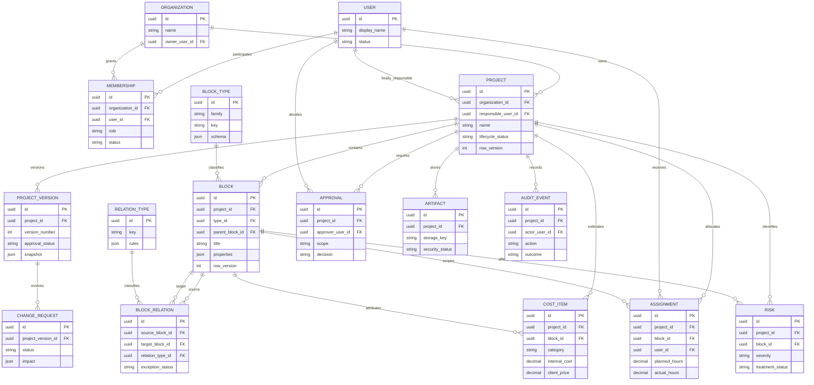

# Modelo conceptual de datos

Este esquema fija relaciones y propiedad; no sustituye las migraciones SQL.

## Reglas invariantes

- Cada proyecto tiene un solo propietario organizacional.
- Cada proyecto tiene un responsable final.
- Un bloque compartido existe una vez y puede relacionarse con múltiples módulos.
- Las relaciones siempre poseen un tipo explícito.
- Las versiones aprobadas son inmutables; un cambio crea una nueva propuesta.
- Horas planeadas y reales se almacenan por separado.
- Costo interno y precio al cliente se almacenan por separado y tienen permisos distintos.
- Los eventos de auditoría no se editan desde los clientes.
