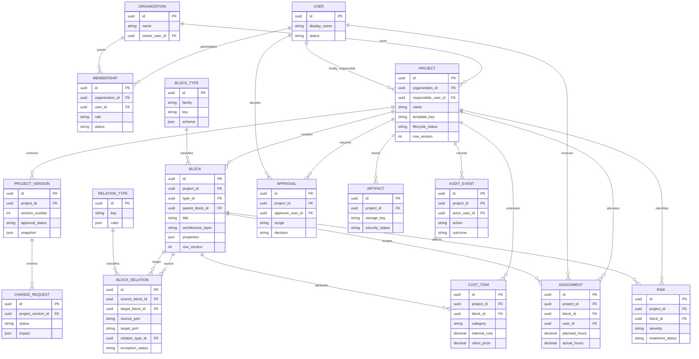

# Modelo conceptual de datos

Este esquema fija relaciones y propiedad; no sustituye las migraciones SQL.

## Reglas invariantes

- Cada proyecto tiene un solo propietario organizacional.
- Cada proyecto tiene un responsable final.
- Un bloque compartido existe una vez y puede relacionarse con múltiples módulos.
- Las relaciones siempre poseen un tipo explícito.
- Cada relación conserva un puerto de salida y uno de entrada entre izquierda,
  derecha, arriba y abajo; mover un bloque no cambia esos anclajes.
- Editar una relación actualiza origen, destino, puertos, tipo y criticidad como
  una operación atómica con control de versión. El validador rechaza
  autorrelaciones, extremos inexistentes, duplicados semánticos y cambios que
  involucren bloques aprobados.
- Un bloque puede proyectarse en una capa de arquitectura: experiencia, servicios,
  datos o infraestructura. La ausencia de capa significa que el bloque no aparece
  en esa proyección; no se duplica el registro.
- Las versiones aprobadas son inmutables; un cambio crea una nueva propuesta.
- Horas planeadas y reales se almacenan por separado.
- Costo interno y precio al cliente se almacenan por separado y tienen permisos distintos.
- Los eventos de auditoría no se editan desde los clientes.

## Prototipo local

La migración SQLite `user_version = 6` conserva `template_key` en cada proyecto y
conserva `source_port` y `target_port` en `relations`. Para evitar bucles
innecesarios, las relaciones heredadas reciben el par de puertos enfrentados más
coherente según la posición de sus bloques; las nuevas conservan exactamente los
puntos elegidos por la persona. La migración desde la versión 1 también mantiene
la incorporación de `architecture_layer` y conserva bloques y relaciones. Los
proyectos anteriores reciben `web-application` como plantilla de origen; los
nuevos pueden usar también `blank-canvas`.

La versión 6 agrega `planning_profiles`, un registro local uno a uno con cada
proyecto. Su contenido tipado conserva definición del problema, objetivo,
resultado del análisis de mercado, plazo, capacidad, presupuesto, horas y
tarifas por rol, costos fijos, servicios periódicos, reserva y margen. SQLite
aplica la propiedad mediante clave foránea y las operaciones usan parámetros;
al cargar se valida tanto el identificador de proyecto como la versión del
perfil antes de calcular resultados.

La factibilidad y la cotización no se guardan como hechos independientes:
`ProjectPlanningEngine` las deriva del grafo vigente y del perfil. De esta forma,
cambiar alcance, relaciones críticas o supuestos recalcula costo interno, precio
propuesto y las diez dimensiones sin perder la separación entre propuesta y
aprobación humana.

La configuración tecnológica del flujo de creación se materializa en el mismo
grafo: frontend, API, autenticación, backend, base de datos e infraestructura
son bloques únicos conectados por relaciones tipadas. En este corte no se
duplica la selección en otra tabla; sus valores quedan visibles en títulos y
descripciones de los bloques generados. Una combinación discutible conserva el
plan, marca el bloque de API con advertencia y eleva la relación afectada como
crítica.

## Primer esquema central

Las migraciones PostgreSQL `0001` y `0002` materializan usuarios, identidades
OIDC, organizaciones, membresías, proyectos, claves de idempotencia y eventos de
auditoría. El rol de aplicación no accede directamente a las tablas de
identidad. RLS filtra por el usuario resuelto en la transacción y una escritura
en otra organización se rechaza aunque el cliente proporcione su UUID.

Bloques, relaciones, perfiles de planeación y versiones permanecen todavía en
SQLite. Se incorporarán al esquema central mediante migraciones nuevas antes de
activar sincronización; el esquema conceptual anterior continúa siendo su
contrato de diseño.
