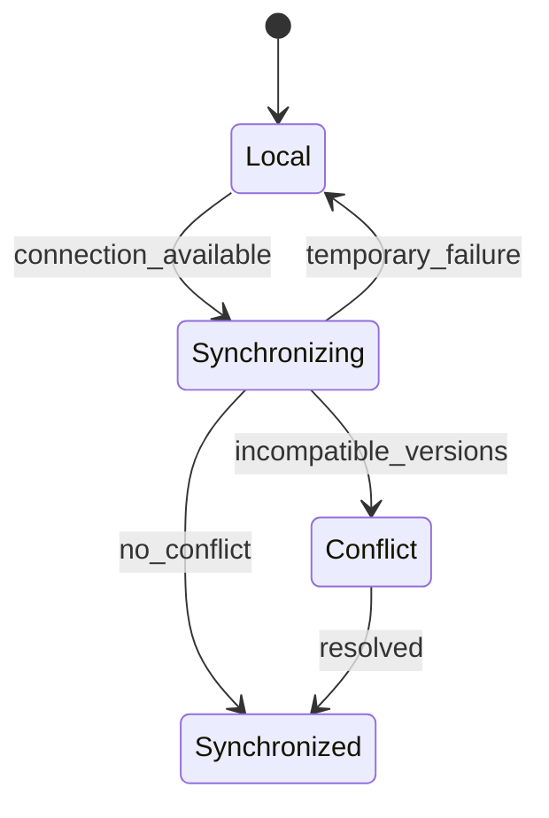

# Sincronización y trabajo offline

## Objetivo

Permitir consulta y edición con conectividad limitada sin ocultar al usuario el estado real de sus cambios.

## Estados visibles

- Guardado localmente.
- Sincronizando.
- Sincronizado.
- Requiere conexión.
- Conflicto pendiente.
- Rechazado por permisos o reglas.

## Reglas

- El cliente usa identificadores generados sin conexión.
- Cada proyecto local conserva un identificador, plantilla, grafo y perfil de
  planeación separados; cambiar de proyecto carga únicamente sus bloques,
  relaciones, supuestos, horas y tarifas.
- Cada entidad mutable mantiene una versión para control optimista.
- Los comandos críticos usan claves de idempotencia.
- Una versión aprobada no se fusiona silenciosamente.
- Los conflictos de texto simple pueden ofrecer combinación asistida.
- Los conflictos de alcance, costo, arquitectura o aprobación requieren una decisión explícita.
- Al cerrar la aplicación se informa si quedan cambios solo locales.

## Límite de PowerSync

Las reglas de sincronización determinan qué información puede descargarse. Las mutaciones que llegan desde un cliente deben atravesar las reglas de Project Core antes de convertirse en estado autorizado.
