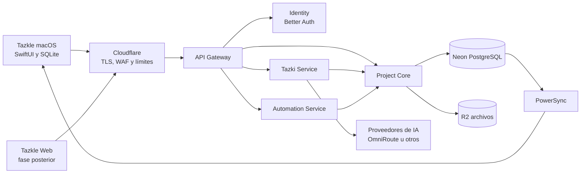
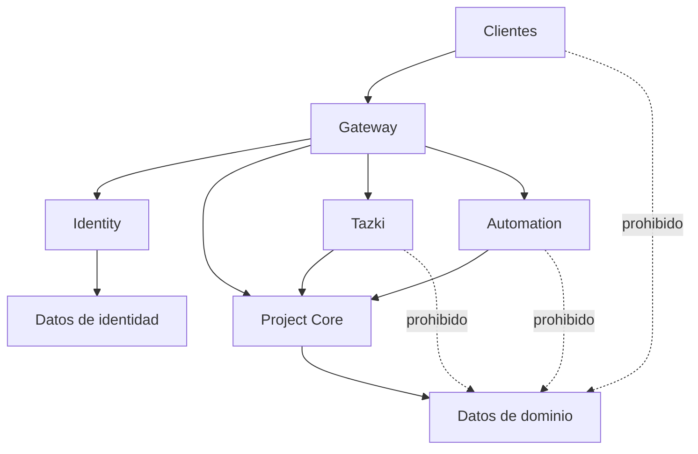

# Arquitectura del sistema

## Contexto

## Servicios iniciales

### Identity

- Better Auth 1.6.25 como emisor OIDC/OAuth 2.1 reemplazable.
- Acceso y alta alojados por correo, Google o Microsoft; la app nativa nunca
  recibe contraseñas ni client secrets de los providers.
- Cliente público nativo `tazkle-macos`, Authorization Code y PKCE S256.
- Access tokens ES256 de 15 minutos, refresh revocable y `userinfo`.
- Esquema PostgreSQL `auth` y rol runtime dedicado sin acceso al dominio.

### API Gateway

- Verificación OIDC mediante JWKS fijo y normalización de identidad.
- Emisión de una aserción interna de 30 segundos para Project Core.
- Validación de método, ruta, contenido y tamaño.
- Rate limiting y correlación de peticiones.
- Enrutamiento hacia los servicios internos.
- No contiene reglas complejas del dominio.

### Project Core

- Fuente de autoridad para proyectos, bloques, relaciones, versiones y aprobaciones.
- Autorización por organización, proyecto, recurso y acción.
- Reglas de factibilidad, costos, capacidad e impacto.
- Escrituras transaccionales y auditoría.
- Resolución de identidades externas, espacios personales e idempotencia.

### Tazki Service

- Entrevistas, estructuración, análisis y generación de variantes.
- Abstracción de proveedores y presupuestos de IA.
- Salidas estructuradas y validadas.
- Solo genera propuestas; no aprueba ni escribe directamente el dominio.

### Automation Service

- Trabajos asíncronos, exportaciones, notificaciones y procesos programados.
- Operaciones idempotentes y reintentables.
- Solicita cambios a Project Core; no evita sus controles.

## Propiedad de datos

- Project Core es propietario del estado de dominio.
- Neon almacena el estado central y las políticas de filas.
- SQLite mantiene una copia local para trabajo offline.
- PowerSync distribuye y recibe cambios sincronizables, pero no sustituye la autorización de escritura.
- R2 almacena binarios; la base conserva metadata, estado y permisos.

## Regla de dependencia

## Estado del corte técnico

- Runtime seleccionado: Node.js 22, TypeScript, Hono y Zod.
- Los cuatro servicios de dominio se mantienen y se añadió Identity como quinto
  límite especializado.
- Sólo Gateway publica HTTP. Project Core accede al esquema de dominio e
  Identity únicamente al esquema `auth`, con roles PostgreSQL diferentes.
- Better Auth es la implementación actual, pero el cliente y Gateway continúan
  desacoplados mediante OIDC.
- Tres migraciones versionadas crean plataforma, organizaciones, membresías,
  proyectos, RLS, idempotencia, auditoría y el esquema de Better Auth.
- PostgreSQL local prepara replicación lógica, sin afirmar todavía una
  integración operativa con PowerSync.

## Decisiones pendientes antes del código productivo

- Despliegue HTTPS del emisor y verificación de correo/MFA antes de producción.
- Viabilidad técnica, licencia y continuidad de OmniRoute.
- Estrategia de despliegue por ambiente.
- Contratos OpenAPI/eventos y política de versionado.
