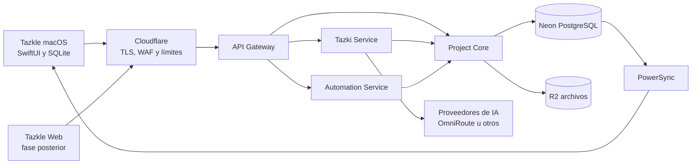
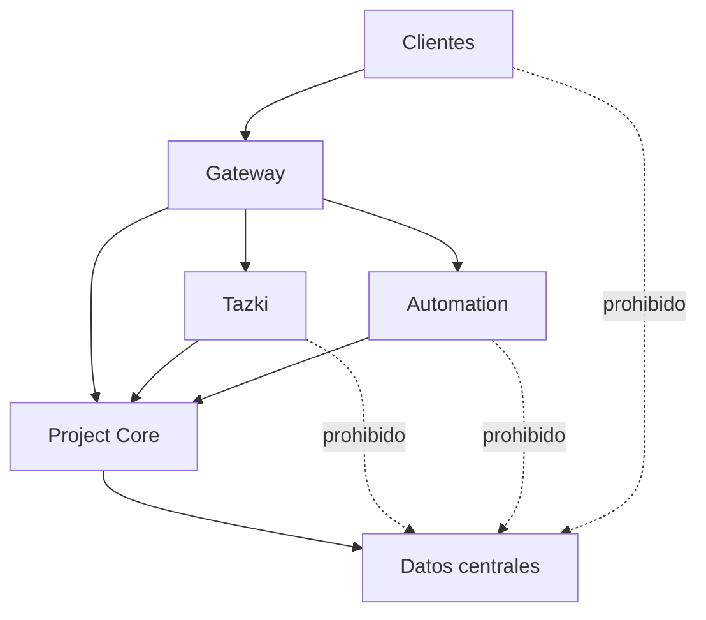

# Arquitectura del sistema

## Contexto

## Servicios iniciales

### API Gateway

- Autenticación y normalización de identidad.
- Validación de método, ruta, contenido y tamaño.
- Rate limiting y correlación de peticiones.
- Enrutamiento hacia los servicios internos.
- No contiene reglas complejas del dominio.

### Project Core

- Fuente de autoridad para proyectos, bloques, relaciones, versiones y aprobaciones.
- Autorización por organización, proyecto, recurso y acción.
- Reglas de factibilidad, costos, capacidad e impacto.
- Escrituras transaccionales y auditoría.

### Tazki Service

- Entrevistas, estructuración, análisis y generación de variantes.
- Abstracción de proveedores y presupuestos de IA.
- Salidas estructuradas y validadas.
- Solo genera propuestas; no aprueba ni escribe directamente el dominio.

### Automation Service

- Trabajos asíncronos, exportaciones, notificaciones y procesos programados.
- Operaciones idempotentes y reintentables.
- Solicita cambios a Project Core; no evita sus controles.

## Propiedad de datos

- Project Core es propietario del estado de dominio.
- Neon almacena el estado central y las políticas de filas.
- SQLite mantiene una copia local para trabajo offline.
- PowerSync distribuye y recibe cambios sincronizables, pero no sustituye la autorización de escritura.
- R2 almacena binarios; la base conserva metadata, estado y permisos.

## Regla de dependencia

## Decisiones pendientes antes del código productivo

- Runtime y framework exactos de los servicios.
- Proveedor definitivo de identidad.
- Viabilidad técnica, licencia y continuidad de OmniRoute.
- Estrategia de despliegue por ambiente.
- Contratos OpenAPI/eventos y política de versionado.
