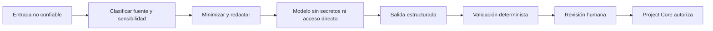

# Seguridad de Tazki y APIs externas

## Principio

La idea, bloques, documentos, respuestas del modelo y contenido externo son datos no confiables. El modelo no recibe autoridad por interpretar esos datos.

## Reglas para proveedores

- Las claves viven en el almacén de secretos del servicio.
- La aplicación macOS nunca contiene claves de proveedor.
- Allowlist de hosts, modelos y operaciones.
- Timeout, límite de tamaño, tokens, costo y reintentos.
- Circuit breaker y proveedor alternativo cuando sea apropiado.
- Registro del proveedor y modelo, nunca del secreto.
- El contenido enviado se limita al contexto necesario.
- La respuesta se valida antes de persistirla.

## Prompt injection

- Política y datos se mantienen separados.
- Ningún secreto se coloca en el system prompt.
- Tazki no escribe directamente en Neon ni R2.
- Las herramientas disponibles dependen de la tarea y el permiso del usuario.
- La salida se limita a esquemas explícitos.
- Enlaces, instrucciones, costos y referencias se validan con código.
- Los cambios se guardan como propuestas versionadas.
- Una acción crítica vuelve a Gateway y Project Core y requiere aprobación.

No se promete eliminar completamente prompt injection; se limita su impacto y se conserva una decisión humana verificable.

## Prototipo del panel macOS

- El panel local muestra recomendaciones deterministas de demostración y no llama
  a proveedores externos.
- El contexto visible se limita al apartado, la subvista y, en Mapa o
  Arquitectura, el bloque seleccionado.
- Perfil y configuración queda fuera del espacio de Tazki.
- Preparar una variante no modifica el grafo, no persiste una aprobación y no
  simula una respuesta remota.
- Las preguntas escritas se mantienen sólo en estado efímero y se limitan a 500
  caracteres; la interfaz declara que no fueron enviadas.
