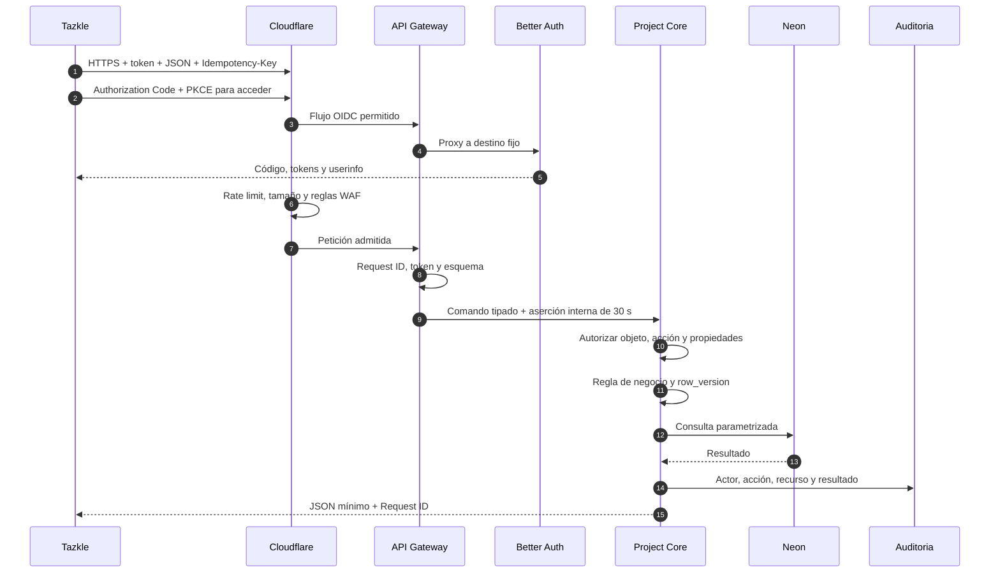

# Seguridad de peticiones

## Recorrido



## Headers aceptados

| Header | Política |
|---|---|
| `Authorization` | Token de corta duración. Nunca se coloca en URL. |
| `Content-Type` | `application/json` para comandos JSON. |
| `Accept` | `application/json` en la API. |
| `Idempotency-Key` | Requerida para mutaciones críticas y reintentos. |
| `X-Client-Version` | Compatibilidad; no concede permisos. |
| `Origin` | Verificado en la versión web. |

El servidor genera o normaliza el Request ID. Encabezados de rol, organización o permiso enviados por un cliente no constituyen autoridad.

## Implementación observada

- Gateway verifica firma OIDC, emisor, audiencia, expiración y sujeto mediante
  JWKS configurado; no obtiene la URL desde el token o la petición.
- Sólo acepta JWT compactos firmados y limita el tamaño de `Authorization`.
- Project Core no recibe el access token externo. Verifica una aserción interna
  `HS256`, ligada a su audiencia y al Request ID.
- La creación de proyectos exige una clave de idempotencia con alfabeto y tamaño
  acotados.
- Gateway y Project Core aplican el mismo esquema estricto y rechazan
  propiedades desconocidas.
- Identity limita intentos de acceso y alta, conserva tokens almacenados en
  forma hash y emite ES256. El cliente nativo no usa client secret.
- Las pantallas alojadas aplican CSP con nonce por respuesta, bloquean frames,
  caché y recursos de terceros.
- Gateway convierte respuestas de navegación de Better Auth en redirects sólo
  hacia las tres pantallas allowlisted o hacia el callback fijo de la app.

## Respuestas sensibles

```http
Content-Type: application/json; charset=utf-8
Cache-Control: no-store
X-Content-Type-Options: nosniff
Strict-Transport-Security: max-age=31536000; includeSubDomains
```

La versión web añadirá CSP, Referrer-Policy, CORS específico y protección CSRF si la autenticación usa cookies.

## Validación

- Métodos y rutas permitidos.
- Tipo y tamaño de contenido.
- JSON válido y esquema por operación.
- Longitud, formato, rango y enumeraciones.
- Rechazo de propiedades desconocidas.
- Autorización sobre organización, proyecto, bloque y campo.
- Control optimista de versiones.
- Consultas parametrizadas y allowlist para identificadores dinámicos.
- Errores sin stack traces, SQL ni secretos.

Los payloads internos de drag and drop siguen una allowlist cerrada
(`block:<uuid>` o `template:<familia>`). El cliente rechaza texto libre, rutas,
familias desconocidas y valores con componentes adicionales antes de alterar el
modelo. Esto no sustituye la autorización del servidor cuando exista sincronización.

## Códigos relevantes

- `400`: petición mal formada.
- `401`: identidad ausente o inválida.
- `403`: acción no autorizada.
- `409`: conflicto o versión desactualizada.
- `413`: contenido excesivo.
- `415`: tipo no soportado.
- `422`: regla de negocio no satisfecha.
- `429`: límite excedido.
