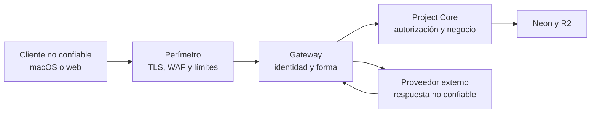

# Modelo inicial de amenazas

## Activos

- Arquitectura, alcance y documentación de proyectos.
- Costos internos, tarifas, presupuesto y precio al cliente.
- Identidades, roles, capacidad y asignaciones.
- Historial, aprobaciones y evidencia de decisiones.
- Archivos y entregables.
- Credenciales de servicios y proveedores de IA.

## Fronteras de confianza

## Amenazas prioritarias

| Amenaza | Control principal |
|---|---|
| Acceso entre organizaciones | Autorización por objeto, rol mínimo y RLS |
| Escalada de privilegios | Permisos en servidor; nunca confiar en roles del cliente |
| SQL injection | Esquemas tipados y consultas parametrizadas |
| Mass assignment | DTO por comando y rechazo de campos desconocidos |
| SSRF | Allowlist de destinos, bloqueo de redes internas y límites |
| Command injection | No usar shell con datos externos |
| XSS o Markdown malicioso | Texto por defecto, sanitización y CSP web |
| Prompt injection | Modelo sin secretos ni autoridad; salida validada |
| Archivo malicioso | Cuarentena, firma, tamaño, escaneo y URL firmada |
| Replay o duplicación | Idempotency-Key, expiración y control de versión |
| Fuga en logs | Logs estructurados y redacción de secretos |
| Manipulación offline | Firma de identidad, autorización al sincronizar y auditoría |
| Abuso de IA/costos | Presupuestos, rate limits y circuit breaker |

## Principios

- Defensa en profundidad.
- Denegar por defecto.
- Mínimo privilegio.
- Separación entre propuesta y aprobación.
- Secretos fuera de clientes, repositorio, prompts y logs.
- Errores externos genéricos; diagnósticos internos correlacionados.
- Eventos de auditoría inmutables y minimizados.

## Revisión

Este modelo se actualizará cuando se elijan identidad, runtime, proveedor de IA y estrategia de despliegue. Cada nueva integración requiere revisar amenazas, datos enviados y capacidad de revocación.
