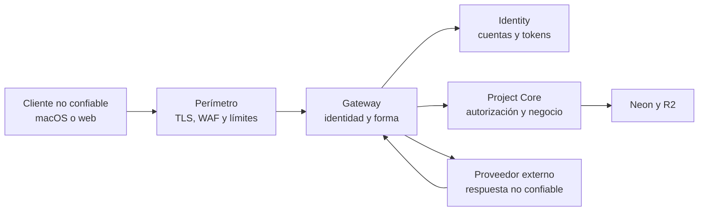

# Modelo inicial de amenazas

## Activos

- Arquitectura, alcance y documentación de proyectos.
- Costos internos, tarifas, presupuesto y precio al cliente.
- Identidades, roles, capacidad y asignaciones.
- Historial, aprobaciones y evidencia de decisiones.
- Archivos y entregables.
- Credenciales de servicios y proveedores de IA.

## Fronteras de confianza

## Amenazas prioritarias

| Amenaza | Control principal |
|---|---|
| Acceso entre organizaciones | Autorización por objeto, rol mínimo y RLS |
| Escalada de privilegios | Permisos en servidor; nunca confiar en roles del cliente |
| Robo o fijación de sesión | PKCE, state, cookies HttpOnly, tokens cortos y revocación |
| Fuerza bruta de cuenta | Rate limits por endpoint y errores de credencial genéricos |
| Redirect OAuth abierto | Cliente y callback migrados; allowlist adicional en Gateway |
| SQL injection | Esquemas tipados y consultas parametrizadas |
| Mass assignment | DTO por comando y rechazo de campos desconocidos |
| SSRF | Allowlist de destinos, bloqueo de redes internas y límites |
| Command injection | No usar shell con datos externos |
| XSS o Markdown malicioso | Texto por defecto, sanitización y CSP web |
| Prompt injection | Modelo sin secretos ni autoridad; salida validada |
| Archivo malicioso | Cuarentena, firma, tamaño, escaneo y URL firmada |
| Replay o duplicación | Idempotency-Key, expiración y control de versión |
| Fuga en logs | Logs estructurados y redacción de secretos |
| Manipulación offline | Firma de identidad, autorización al sincronizar y auditoría |
| Abuso de IA/costos | Presupuestos, rate limits y circuit breaker |

## Principios

- Defensa en profundidad.
- Denegar por defecto.
- Mínimo privilegio.
- Separación entre propuesta y aprobación.
- Secretos fuera de clientes, repositorio, prompts y logs.
- Errores externos genéricos; diagnósticos internos correlacionados.
- Eventos de auditoría inmutables y minimizados.

## Superficie de Cuenta y organización

- La matriz de permisos de la aplicación es informativa; nunca constituye la
  decisión de autorización.
- Invitaciones, cambios de rol, transferencia de responsabilidad, tarifas, cierre
  de sesiones y configuración de IA requieren Project Core y auditoría antes de
  considerarse operaciones reales.
- Las credenciales de identidad se almacenarán en Keychain y las claves de
  proveedores permanecerán exclusivamente en el almacén de secretos del servicio.
- La puerta nativa no solicita datos de cuenta. Nombre, correo y contraseña se
  capturan exclusivamente en Identity; la contraseña no vuelve al cliente y
  ningún dato del formulario se persiste en preferencias, SQLite ni logs.
- El perfil visible se obtiene de `userinfo` descubierto por OIDC. Los claims se
  limitan, validan y se mantienen en memoria; una respuesta ausente o inválida
  nunca se sustituye por una persona ficticia.
- Hasta conectar organización y sincronización, la interfaz muestra estados
  vacíos y no fabrica membresías, roles, capacidad, tarifas ni operaciones
  remotas exitosas.

## Selector local de proyectos

- El selector sólo abre identificadores obtenidos del índice local; no acepta
  rutas, nombres de tabla ni identificadores arbitrarios como consultas.
- Cada carga filtra bloques y relaciones por `project_id`, y las escrituras se
  ejecutan dentro de una transacción con consultas parametrizadas.
- La plantilla se conserva como un valor enumerado. Una clave desconocida se
  trata como datos locales inválidos y no se interpreta dinámicamente.
- Las tecnologías de una plantilla se eligen desde catálogos enumerados y sólo
  generan texto, bloques y relaciones locales. Los nombres de proveedores no
  aceptan endpoints, credenciales, código ni parámetros ejecutables.
- Las advertencias de compatibilidad son deterministas. No autorizan conexiones
  externas ni incorporan secretos; una integración real requerirá Gateway,
  Project Core, autorización y almacén de secretos.
- La edición local de una relación utiliza un comando específico; no acepta
  propiedades arbitrarias. El grafo completo se valida antes de sustituir el
  estado persistido y se rechazan extremos inexistentes, autorrelaciones,
  duplicados semánticos y cambios sobre alcance aprobado.
- Este aislamiento local no sustituye la autorización por organización y objeto
  que Project Core deberá aplicar cuando exista sincronización.

## Revisión

El runtime y el contrato OIDC genérico ya fueron seleccionados. El cliente
macOS implementa navegador externo, PKCE S256, validación de `state`, callback
registrado, renovación en Keychain y revocación cuando el proveedor la expone.
No contiene client secret ni formulario de cuenta. Las acciones nativas eligen
entre inicio de sesión y creación mediante parámetros OIDC allowlisted; los
datos se capturan una sola vez en Identity. La identidad de interfaz procede de
`userinfo`, se valida antes de presentarse y no se persiste como una fuente
local de autoridad.

Better Auth ya opera localmente detrás de Gateway y se comprobó discovery OIDC,
ES256, PKCE y el cliente nativo registrado. Antes de producción siguen
pendientes HTTPS público, verificación de correo, recuperación, MFA, rotación
operativa y auditoría de dependencias. Cada despliegue debe revisar amenazas,
datos enviados y capacidad real de revocación.
