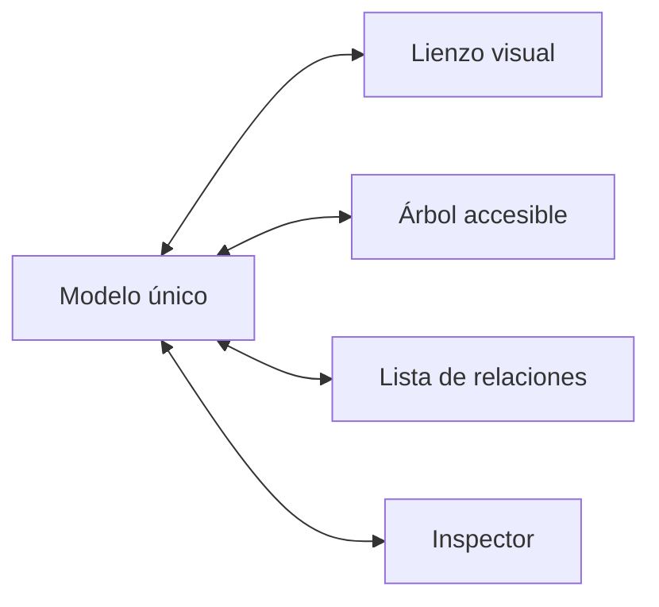

# Accesibilidad

## Estándar

- Patrones nativos y pautas de accesibilidad de Apple para macOS.
- WCAG 2.2 nivel AA como referencia medible y requisito para la versión web.
- Verificación con Accessibility Inspector, VoiceOver, teclado y ajustes del sistema.

## Riesgo principal: el lienzo

Cada operación de arrastre debe tener una alternativa:

- Crear bloque mediante botón, menú o teclado.
- Conectar mediante origen, tipo de relación y destino.
- Mover y reordenar con comandos.
- Editar desde un inspector accesible.
- Distribución automática.
- Vista equivalente como árbol y lista de relaciones.

## VoiceOver

Un bloque anuncia título, tipo, estado, responsables, advertencias y número de relaciones. Las conexiones se expresan también como texto; ninguna línea o color es la única fuente de significado.

## Teclado

- Orden de foco estable y visible.
- Sin trampas de teclado.
- Restauración de foco al cerrar hojas y paneles.
- Flechas para listas, árboles y nodos.
- Acciones equivalentes en menú y paleta de comandos.

## Percepción

- Estado expresado con texto, icono y color.
- Contraste verificado en temas claro, oscuro y mayor contraste.
- Tamaño y separación adecuados de objetivos.
- Zoom y aumento de texto sin pérdida de contenido.
- Gráficas acompañadas por tablas o resúmenes textuales.

## Cognición

- Revelado progresivo de detalles.
- Lenguaje sencillo y glosario para términos técnicos.
- Una acción principal clara por contexto.
- Errores con explicación y forma de recuperación.
- Confirmación explícita de guardado, sincronización y aprobación.

## Tazki

La mascota refuerza estados, pero nunca es el único canal. Sus animaciones respetan Reduce Motion; sonidos y movimiento no esenciales se pueden desactivar.

## Criterio de aceptación

El recorrido idea → mapa → factibilidad → cotización → aprobación debe poder completarse usando mouse, solo teclado o VoiceOver, sin pérdida de información al trabajar offline.
