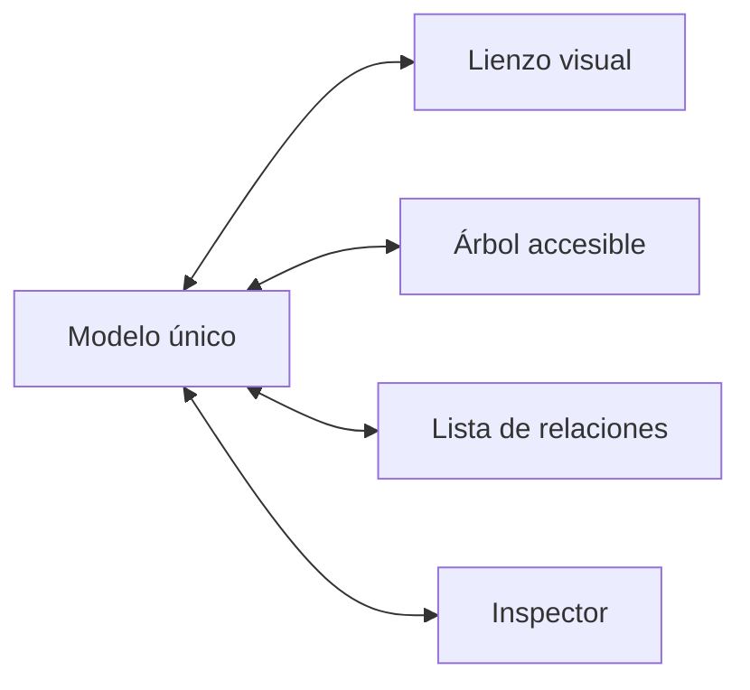

# Accesibilidad

## Estándar

- Patrones nativos y pautas de accesibilidad de Apple para macOS.
- WCAG 2.2 nivel AA como referencia medible y requisito para la versión web.
- Verificación con Accessibility Inspector, VoiceOver, teclado y ajustes del sistema.

## Riesgo principal: el lienzo

Cada operación de arrastre debe tener una alternativa:

- Crear bloque mediante botón, menú o teclado.
- Conectar mediante origen, tipo de relación y destino.
- Mover y reordenar con comandos.
- Recorrer el proyecto desde su proyección de lista y volver al origen del lienzo
  mediante `Mapa → Volver al origen del lienzo` (`⌘0`).
- Editar desde un inspector accesible.
- Eliminar desde el inspector, menú contextual o `⌫`, siempre con confirmación
  textual, relación de impacto y recuperación mediante `⌘Z`.
- Distribución automática.
- Vista equivalente como árbol y lista de relaciones.
- Cada puerto de conexión es enfocable, anuncia bloque y lado, y abre el formulario
  con el bloque y punto de origen preseleccionados. Los selectores de punto de
  salida y entrada permiten completar la relación sin precisión de puntero.

## VoiceOver

Un bloque anuncia título, tipo, estado, responsables, advertencias y número de
relaciones. Las conexiones se expresan también como texto, incluyendo punto de
salida y entrada; ninguna línea, cruce o color es la única fuente de significado.

El resaltado durante una conexión combina borde, grosor y estado del control. El
color de la línea viva es apoyo visual, no la única confirmación de destino.
Durante un movimiento, el hueco de origen combina superficie vacía y borde
discontinuo. La silueta de destino añade la etiqueta `Soltar aquí`; ninguna de
las dos indicaciones depende únicamente de una variación de color.

## Teclado

- Orden de foco estable y visible.
- Sin trampas de teclado.
- Restauración de foco al cerrar hojas y paneles.
- Flechas para listas, árboles y nodos.
- Acciones equivalentes en menú y paleta de comandos.

## Percepción

- Estado expresado con texto, icono y color.
- Contraste verificado en temas claro, oscuro y mayor contraste.
- Tamaño y separación adecuados de objetivos.
- Zoom y aumento de texto sin pérdida de contenido.
- Gráficas acompañadas por tablas o resúmenes textuales.

## Cognición

- Revelado progresivo de detalles.
- Lenguaje sencillo y glosario para términos técnicos.
- Una acción principal clara por contexto.
- Errores con explicación y forma de recuperación.
- Confirmación explícita de guardado, sincronización y aprobación.

## Cuenta y organización

- Perfil, disponibilidad, organización, miembros, tarifas, IA, sincronización y
  seguridad usan etiquetas persistentes; el placeholder nunca sustituye el nombre
  del campo.
- Un estado distingue `Preferencia local` de `Escenario de prototipo` para evitar
  que una acción visual se interprete como un cambio remoto.
- La matriz de permisos puede recorrerse por rol y expresa cada nivel mediante
  texto e icono además del color.
- Los estados de sincronización y autenticación anuncian qué existe localmente,
  qué está pendiente y qué requiere infraestructura.
- La referencia de atajos se puede buscar y cada acción presenta contexto y
  combinación de teclas como un único elemento semántico.

## Tazki

La mascota refuerza estados, pero nunca es el único canal. Sus animaciones respetan Reduce Motion; sonidos y movimiento no esenciales se pueden desactivar.

El botón flotante se acompaña con el texto `Explorar alternativas`, dispone del
atajo `⌥⌘T` y no es la única entrada al asistente. El panel anuncia contexto,
estado de conexión y límites mediante texto. Comparar, preparar y descartar son
botones convencionales; ninguna acción depende del rostro, color o movimiento de
la mascota.

## Criterio de aceptación

El recorrido idea → mapa → factibilidad → cotización → aprobación debe poder completarse usando mouse, solo teclado o VoiceOver, sin pérdida de información al trabajar offline.
